# Zorvyn Assignment — Financial Records Management API

A production-ready **RESTful API** built with **Node.js**, **Express**, and **MongoDB** for managing financial records with role-based access control, analytics, and secure authentication.

---

## Table of Contents

- [Overview](#overview)
- [Features](#features)
- [API Documentation](#api-documentation)
- [Deployment](#deployment)
- [Tech Stack](#tech-stack)
- [Architecture](#architecture)
- [Getting Started](#getting-started)
  - [Prerequisites](#prerequisites)
  - [Installation](#installation)
  - [Environment Variables](#environment-variables)
  - [Seeding the Database](#seeding-the-database)
  - [Running the Server](#running-the-server)
- [API Reference](#api-reference)
  - [Authentication](#authentication)
  - [Admin](#admin)
  - [Records](#records)
  - [Analytics](#analytics)
- [Roles & Permissions](#roles--permissions)
- [Data Models](#data-models)
- [Testing](#testing)
  - [Running Tests](#running-tests)
  - [Test Infrastructure & Coverage](#test-infrastructure--coverage)
- [Project Structure](#project-structure)

---

## Overview

This project implements a secure, multi-role financial records management system. It supports three distinct user roles — **Admin**, **Analyst**, and **Viewer** — each with precisely scoped access to records and analytics. The system features JWT-based authentication delivered via HTTP-only cookies, Zod schema validation, soft-delete record management, and an analytics engine powered by MongoDB aggregation pipelines.

> 🧠 **Thought process:** For a detailed breakdown of the architectural decisions, potential problems, and rationale behind the tech stack, please refer to the [THOUGHT_PROCESS.md](./THOUGHT_PROCESS.md) file.

---

## Features

- **JWT Authentication** — Stateless, cookie-based token delivery with configurable expiry
- **Role-Based Access Control (RBAC)** — Granular route protection via `Admin`, `Analyst`, and `Viewer` roles
- **Financial Record Management** — Full CRUD with soft-delete support and audit tracking (`deletedAt`, `deletedBy`)
- **Advanced Filtering** — Filter records by category, type, date range, and fuzzy text search with pagination
- **Analytics Engine** — Net balance summaries, category-wise aggregations, and monthly trend breakdowns
- **Input Validation** — Request body validation using Zod schemas on all write endpoints
- **Email Notifications** — Nodemailer integration for transactional emails (e.g., new user credentials)
- **Security Hardening** — Helmet headers, CORS, rate limiting (100 req/hour per IP), bcrypt password hashing
- **Global Error Handling** — Centralised `AppError` class and async wrapper (`catchAsync`) across all controllers
- **Testing Suite** — Jest + Supertest integration tests backed by `mongodb-memory-server`

---

## API Documentation

The API is fully documented using Postman and Swagger. You can access the live documentation and collections via the links below:

### Live Postman Docs
- **Public Documentation:** [View on Postman Documenter](https://documenter.getpostman.com/view/34605710/2sBXiqDo8e)
- **Postman Collection:** [Import Collection](https://www.postman.com/dragon-6129/sammaiah-guguloth/collection/34605710-037fae41-910c-433a-bbd8-744c576529a3)

### Swagger UI
When the server is running locally, you can access the interactive Swagger UI at:
`http://localhost:5000/api-docs`

The Swagger UI allows you to directly test the API endpoints with a built-in "Authorize" feature for JWT Bearer tokens.

---

## Deployment

The API is live and can be accessed at the following URL:

🚀 **Live Link:** [https://zorvyn-assignment-fnlh.onrender.com/](https://zorvyn-assignment-fnlh.onrender.com/)

> [!NOTE]
> The live server might take a few seconds to spin up due to Render's free tier "spinning down" after inactivity.

---

## Tech Stack

| Layer | Technology |
|---|---|
| Runtime | Node.js (ESM) |
| Framework | Express 5 |
| Database | MongoDB + Mongoose 9 |
| Authentication | JSON Web Tokens (`jsonwebtoken`) |
| Validation | Zod |
| Password Hashing | bcryptjs |
| Email | Nodemailer |
| Security | Helmet, CORS, express-rate-limit |
| Testing | Jest, Supertest, mongodb-memory-server |
| Dev Tools | Nodemon, cross-env |

---

## Architecture

The system follows a strict, modular **Service-Controller** architecture. Business logic and analytics pipelines are decoupled from standard request parsing, ensuring that authentication (`JWT`), strict request validations (`Zod`), and database querying (`MongoDB`) operate harmoniously. This separation of concerns creates a highly scalable and easily testable codebase.

<p align="center">
  
</p>

---

## Getting Started

### Prerequisites

- **Node.js** v18+
- **MongoDB** instance (local or Atlas)

### Installation

```bash
# Clone the repository
git clone https://github.com/Sammaiah-Guguloth/Zorvyn_Assignment.git
cd Zorvyn_Assignment

# Install dependencies
npm install
```

### Environment Variables

Copy the example file and populate the values:

```bash
cp .env.example .env
```

| Variable | Description |
|---|---|
| `MONGO_URI` | MongoDB connection string |
| `NODE_ENV` | `development` or `production` |
| `PORT` | Server port (default: `5000`) |
| `ADMIN_EMAIL` | Initial admin account email |
| `ADMIN_PASSWORD` | Initial admin account password |
| `APP_NAME` | Application name for email templates |
| `EMAIL_HOST` | SMTP host |
| `EMAIL_PORT` | SMTP port |
| `EMAIL_USERNAME` | SMTP username |
| `EMAIL_PASSWORD` | SMTP password |
| `JWT_SECRET` | Secret key for signing JWTs |

### Seeding the Database

Seed the database with an initial Admin user using the credentials set in `.env`:

```bash
node scripts/seed.js
```

### Running the Server

```bash
# Development (with hot reload)
npm run dev

# Production
npm start
```

The server will be available at `http://localhost:5000`.

---

## API Reference

All endpoints are prefixed with `/api/v1`. The API enforces a global rate limit of **100 requests per hour** per IP.

### API Summary Table

| Category | Method | Endpoint | Access | Description |
| :--- | :--- | :--- | :--- | :--- |
| **Auth** | `POST` | `/auth/login` | Public | Log in with email and password |
| | `POST` | `/auth/change-password` | Private | Change the authenticated user's password |
| **Admin** | `GET` | `/admin/users` | Admin | Retrieve all users |
| | `POST` | `/admin/users` | Admin | Create a new user (Admin / Analyst / Viewer) |
| | `PATCH` | `/admin/users/:id/status` | Admin | Activate or deactivate a user account |
| | `DELETE` | `/admin/users/:id` | Admin | Delete a user permanently |
| **Records** | `GET` | `/records` | All Roles | List and filter records (Pagination included) |
| | `POST` | `/records` | Admin | Create a new financial record |
| | `PATCH` | `/records/:id` | Admin | Update an existing financial record |
| | `DELETE` | `/records/:id` | Admin | Soft-delete a record |
| **Analytics**| `GET` | `/analytics/summary` | Admin, Analyst | Total net balance, income, and expenses |
| | `GET` | `/analytics/stats` | Admin | Category-wise sums and monthly trend data |

---

## Roles & Permissions

| Action | Admin | Analyst | Viewer |
|---|:---:|:---:|:---:|
| Login / Change Password | ✅ | ✅ | ✅ |
| Create / Update / Delete Records | ✅ | ❌ | ❌ |
| View Records | ✅ | ✅ | ✅ |
| View Analytics Summary | ✅ | ✅ | ❌ |
| View Analytics Stats | ✅ | ❌ | ❌ |
| Manage Users | ✅ | ❌ | ❌ |

---

## Data Models

### User

| Field | Type | Description |
|---|---|---|
| `name` | String | Full name |
| `email` | String | Unique email address |
| `password` | String | bcrypt-hashed, hidden from queries |
| `role` | Enum | `admin`, `analyst`, `viewer` |
| `status` | Enum | `active`, `inactive` |
| `isPasswordReset` | Boolean | Tracks first-login password change |

### Record

| Field | Type | Description |
|---|---|---|
| `amount` | Number | Positive transaction amount |
| `type` | Enum | `income` or `expense` |
| `category` | String | e.g., Salary, Food, Rent |
| `date` | Date | Transaction date |
| `description` | String | Optional free-text description |
| `createdBy` | ObjectId | Reference to the creating user |
| `deletedAt` | Date | Soft-delete timestamp (null if active) |
| `deletedBy` | ObjectId | Reference to the deleting user |

> A compound index on `{ deletedAt, type, date }` is applied for optimised query performance on filtered record listings and analytics aggregations.

---

## Testing

The test suite uses **Jest** with **Supertest** for HTTP assertions and **mongodb-memory-server** for an isolated, in-memory MongoDB instance. This guarantees that tests can run anywhere with zero external database dependencies.

### Running Tests

```bash
# Run all automated tests
npm test

# Run tests and generate a complete coverage report
npm test -- --coverage
```

### Test Infrastructure & Coverage

A custom setup script (`tests/setup.js`) orchestrates the in-memory database, automatically clearing collections between tests to ensure complete isolation. The testing scope includes:

- **`auth.test.js`** — Validates login credentials, secure cookie issuance, JWT verification, and the enforced first-login password change logic.
- **`admin.test.js`** — Ensures only Admins can hit provisioning endpoints, verifying user creation, status toggling (active/inactive), and safe deletion algorithms.
- **`record.test.js`** — Covers complete REST CRUD patterns, numeric validation for balances, soft-deletion overrides, and complex filtering algorithms.
- **`analytics.test.js`** — Verifies MongoDB aggregation pipelines ensuring accurate mathematical calculations for net sums, precise categorisation, and monthly grouping.

---

## Project Structure

```
Zorvyn_Assignment/
├── scripts/
│   └── seed.js
├── src/
│   ├── app.js
│   ├── config/
│   │   ├── db.config.js
│   │   └── mailer.config.js
│   ├── controllers/
│   │   ├── admin.controller.js
│   │   ├── analytics.controller.js
│   │   ├── auth.controller.js
│   │   └── record.controller.js
│   ├── middlewares/
│   │   ├── auth.middleware.js
│   │   ├── error.middleware.js
│   │   ├── role.middleware.js
│   │   └── validate.middleware.js
│   ├── models/
│   │   ├── record.model.js
│   │   └── user.model.js
│   ├── routes/
│   │   ├── admin.routes.js
│   │   ├── analytics.routes.js
│   │   ├── auth.routes.js
│   │   └── record.routes.js
│   ├── services/
│   │   ├── analytics.service.js
│   │   └── email.service.js
│   ├── utils/
│   │   ├── appError.util.js
│   │   ├── catchAsync.util.js
│   │   └── constants.util.js
│   └── validations/
│       ├── record.validation.js
│       └── user.validation.js
├── tests/
│   ├── admin.test.js
│   ├── analytics.test.js
│   ├── auth.test.js
│   ├── record.test.js
│   └── setup.js
├── .env.example
├── .gitignore
├── jest.config.js
├── package.json
└── server.js
```

---

> Built by [Sammaiah Guguloth](https://github.com/Sammaiah-Guguloth)
